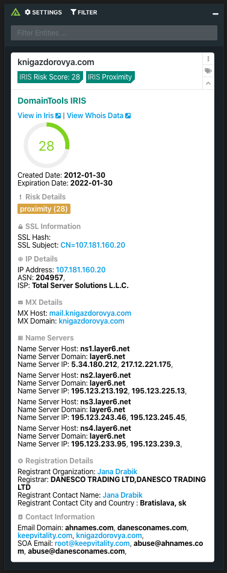

# Polarity DomainTools Iris Integration

Iris is a proprietary threat intelligence and investigation platform that combines enterprise-grade domain intelligence and risk scoring with industry-leading passive DNS data from Farsight Security and other top-tier providers. An intuitive web interface and API atop these data sources help security teams quickly and efficiently investigate potential cybercrime and cyberespionage.

The Polarity DomainTools Iris integration allows Polarity to search Iris for risk information on Domains and Link back out to IRIS if there is associated information less than the count that you set below.

More information on Iris:
https://www.domaintools.com/products/iris

## Iris Integration Options

### DomainTools API Username

API Username associated with your DomainTools account.

### DomainTools API Key

API Key associated with your DomainTools account.

### Minimum Iris Risk Score

Minimum risk score a threat needs to have in order to be displayed.

### Maximum Iris Pivots

The maximum number of pivots for linking out IRIS on a field.

### Blacklist Domains or Ips
Comma separated list of domains that you do not want to lookup in Iris.

### Domain Black List Regex
Domains that match a regular expression that you do not want to lookup in Iris.

## Installation Instructions

Installation instructions for integrations are provided on the [PolarityIO GitHub Page](https://polarityio.github.io/).

## Polarity

Polarity is a memory-augmentation platform that improves and accelerates analyst decision making.  For more information about the Polarity platform please see:

https://polarity.io/
